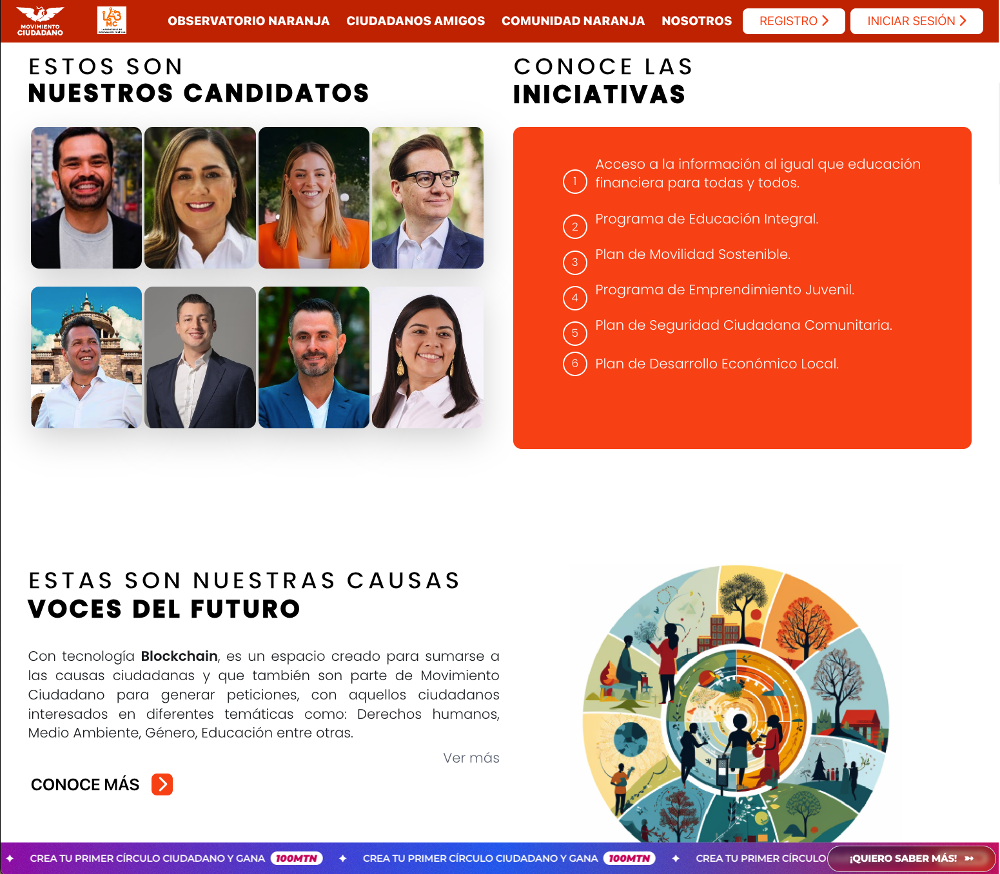
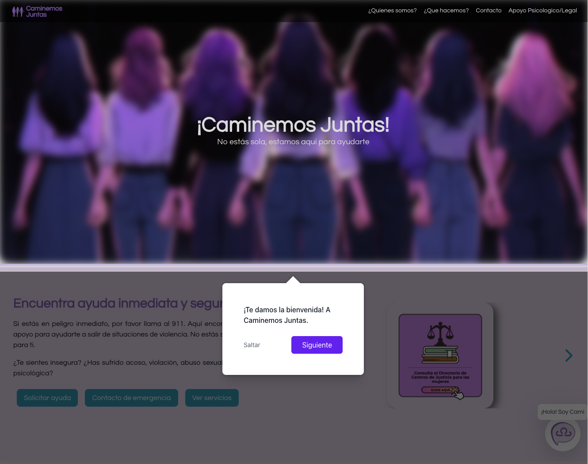
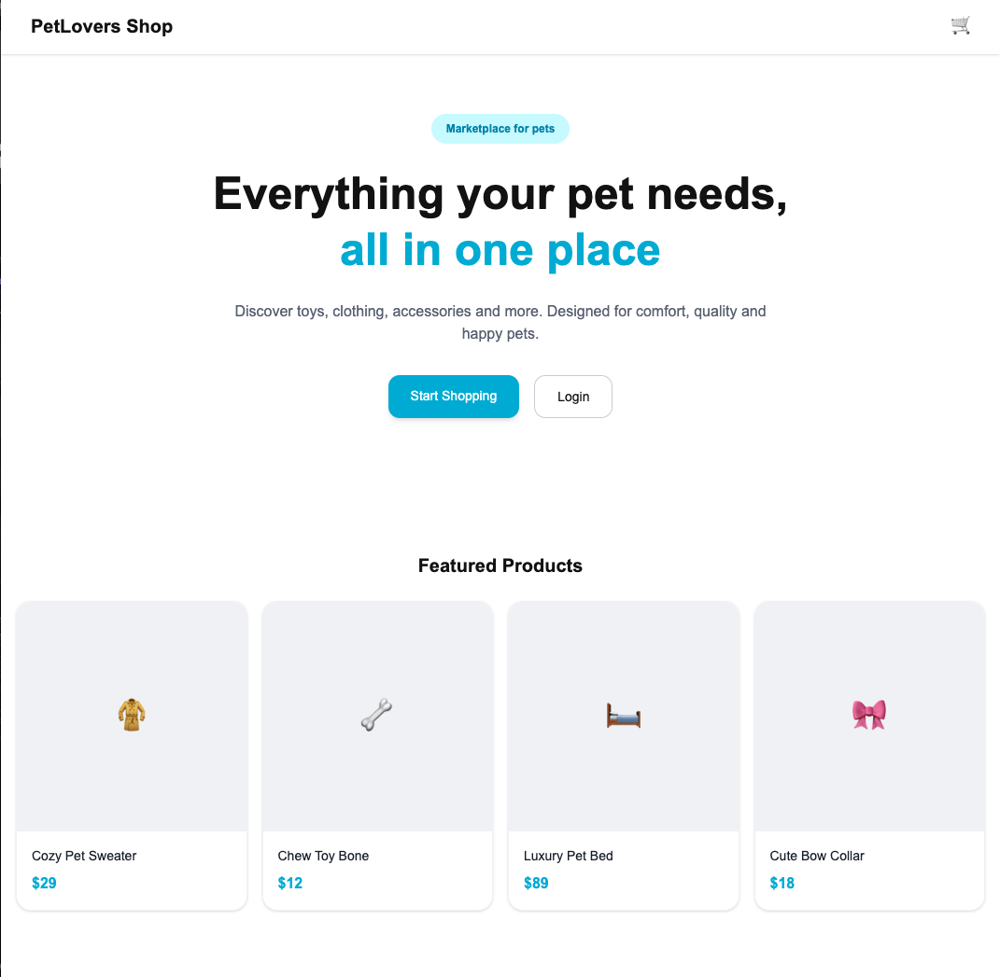

<h1 align="center">🌸 Cecilia Barranco 🌸</h1>

  
  
  

  <b>Ingeniera en Ciencias de la Computación</b> 
  Construyendo interfaces modernas, funcionales y con impacto social ✨

  <a href="https://www.linkedin.com/in/cecilia-barranco/">LinkedIn</a> • 
  <a href="mailto:ceciliaa.baher@gmail.com">Email</a> •
  <a href="https://portfolio-cecilia-rho.vercel.app/">Portfolio</a>

---

## 🌸 Sobre mí

- 💻 Desarrolladora Frontend especializada en **React**
- 🔗 Experiencia consumiendo APIs y conectando frontend–backend
- 🧠 Enfocada en **arquitectura escalable y clean code**
- 💜 Interesada en proyectos con impacto social
- 🚀 Actualmente aprendiendo **performance en React y patrones avanzados**

---

## 🌸 Tecnologías

  

---

## 🌸 Proyectos

<table>
<tr>
<td width="50%">

### 🧡 Movimiento Ciudadano

**Stack:** React · Tailwind · .NET Core · PostgreSQL  

Plataforma cívica con interacción a gran escala.

✔ Dashboards por roles  
✔ Componentes reutilizables  
✔ Optimización (lazy loading + code splitting)

🔗 <a href="https://public.ciudadanosenmovimiento.org/">Ver proyecto</a>

</td>
<td width="50%">

### 💜 Caminemos Juntas

**Stack:** React · Node · PostgreSQL · AI  

Plataforma social para apoyo a mujeres.

✔ Violentómetro interactivo  
✔ Geolocalización de ayuda  
✔ UX accesible  

🔗 <a href="https://www.caminemosjuntas.com/">Ver proyecto</a>  
💻 <a href="https://github.com/ceciliabh/caminemos-juntas">Código</a>

</td>
</tr>

<tr>
<td width="50%">

### 🛒 E-commerce

**Stack:** Next.js · TypeScript · SSR · SEO  

✔ Rutas dinámicas  
✔ Carrito global  
✔ Optimización SEO  

🔗 <a href="https://nextjs-ecommerce-lac-pi.vercel.app/">Ver proyecto</a>  
💻 <a href="https://github.com/ceciliabh/nextjs-ecommerce">Código</a>

</td>
<td width="50%">

### 🤖 Salubot IA

**Stack:** AI · NLP · Chatbot  

✔ Flujo conversacional  
✔ Asistente de hábitos saludables  
✔ Documentación técnica  

</td>
</tr>
</table>

---

## 🌸 GitHub Stats

  
  

---

## 🌸 Contribuciones

  

---

## 🌸 Actualmente

🚀 Arquitectura frontend  
⚡ Performance en React  
🧩 Buenas prácticas y escalabilidad  

---

## 🌸 Contacto

<a href="https://www.linkedin.com/in/cecilia-barranco/">LinkedIn</a> · 
<a href="mailto:ceciliaa.baher@gmail.com">Email</a>

---

  <i>"Transformando líneas de código en soluciones reales."</i> 
  ✨ <b>Cecilia Barranco</b> • 2026 ✨

